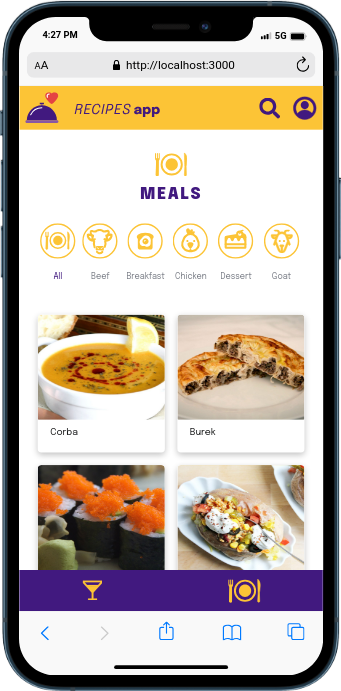
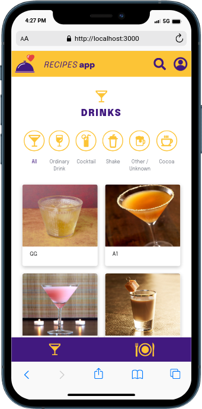
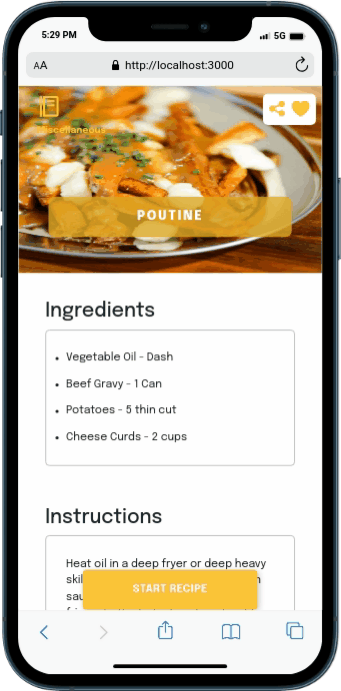
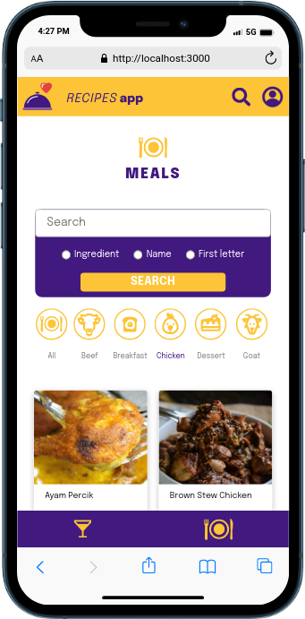

## Recipes App

This project is a web application that allows users to find, save, and share recipes for food and drinks.

## Technologies

The project was developed using the following technologies:

* React
* TypeScript
* CSS Modules

## Features

The following features are available in the project:

* **Favorite:** Users can add recipes to their favorites for quick access in the future.
* **Share:** Users can share recipes with their friends and family through social media or email.
* **Start recipe:** Users can start a recipe to start cooking.
* **Track ingredients used:** Users can track the ingredients used in a recipe to ensure they have everything they need before they start cooking.
* **Filter recipes:** Users can filter recipes by type, such as meat, dessert, goat, cocktail, or shake etc.
* **Search recipes:** Users can search for recipes by name, ingredient, or first letter.

## How to use

To use the project, follow these steps:

1. Open the project in your web browser.
2. Use the search bar to find a recipe.
3. Click on a recipe to view more information.
4. Click "Favorite" to add the recipe to your favorites.
5. Click "Share" to share the recipe with your friends and family.
6. Click "Start recipe" to start cooking.
7. When you are finished cooking, click the "Finish recipe" button to save the recipe to your list of finished recipes.

## Getting Started
1. Clone this repository:
```bash
git@github.com:markoclimakodev/Recipes-App.git
```

2. Access the project folder
```
cd recipes-app
```

3. Install the dependencies
```
npm install
```

4. Run the project
```
npm run dev
```
## Screenshots
<div style="display: flex; flex-direction: column; gap: 8px; justify-content: space-between;">
  <div style="display: flex; gap: 8px;">
    
    
    
    
    
  </div>

## Contact

Feel free to connect with us on LinkedIn.

- LinkedIn: [Marcos Climaco](https://www.linkedin.com/in/markoclimako/)
- Linkedin: [João Lucas](https://www.linkedin.com/in/joao-lucas-muniz/)
- Linkedin: [Matheus Motta](https://www.linkedin.com/in/matheus-motta-2104ba121/)
- Linkedin: [Felipe Vergara](https://www.linkedin.com/in/felipe-vergara-58972226a/)
- Linkedin: [Elielton Ramos](https://www.linkedin.com/in/elielton-ramos/)


